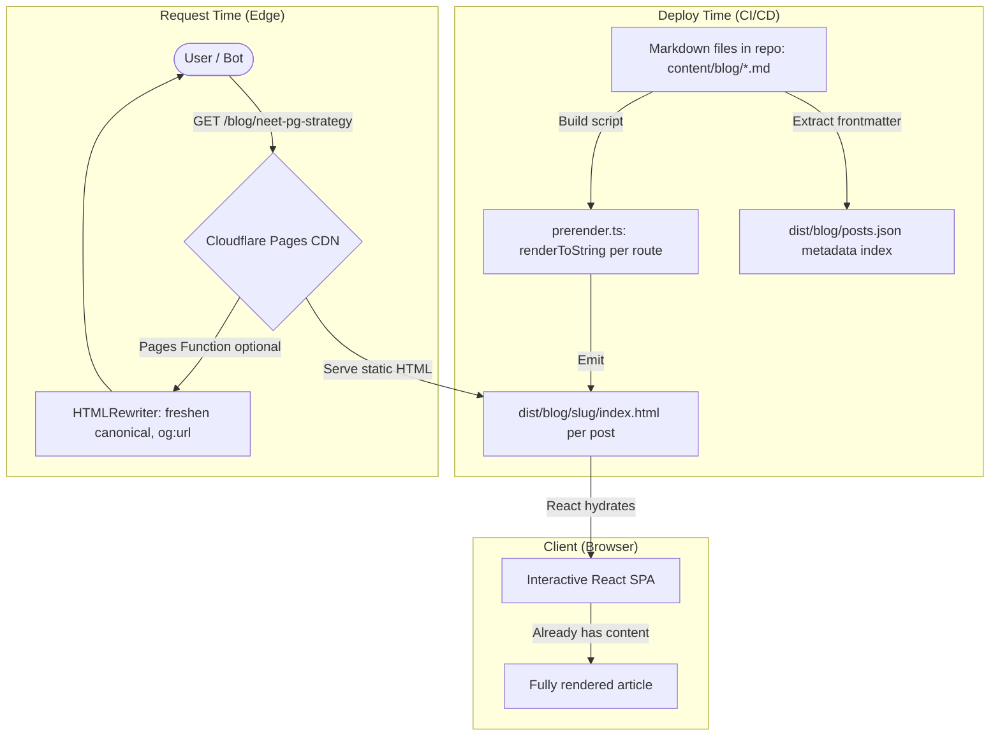

# Blog SEO Architecture & Scalability Standards

This document establishes the architecture, standards, and implementation patterns for adding a high-performance, search-optimized blog to the OpenMedQ React SPA, fully conforming to the Cloudflare Free Tier limits ($0/month) and the Clay Design System guidelines.

Last updated: 2026-06-14 (based on latest Google SEO guidance, Cloudflare docs, and industry research).

---

## 🚨 The Challenge: SPA SEO & Free-Tier Limits

To draw organic traffic, blog articles must be:
1. **Fully crawlable by search engines** (Googlebot, Bingbot) with real HTML content visible *without JavaScript execution*.
2. **Optimized for AI Overviews**, which now cite structured, expert-backed content from authoritative topical sources.
3. **Highly performant** (Core Web Vitals: LCP, INP, CLS) to rank well.
4. **Zero-cost to serve**, avoiding D1 query counts and Worker request limits (100k/day).

### Why Client-Side-Only Rendering Fails for Blog SEO

| Approach | Googlebot Sees Content? | Social Scrapers (Discord, Twitter)? | AI Overview Citable? | Cloaking Risk? |
| :--- | :--- | :--- | :--- | :--- |
| `document.title` / `react-helmet` (CSR) | Sometimes (delayed) | No | No | None |
| User-Agent bot detection + dynamic rendering | Yes | Yes | Yes | **High** (Google deprecated this, risks cloaking penalty) |
| **Build-time static HTML (SSG)** | **Yes (immediate)** | **Yes** | **Yes** | **None** |
| HTMLRewriter meta-injection (edge) | Metadata only (body is empty `<div id="root">`) | Yes (metadata) | Partial | Low |

> [!CAUTION]
> **Dynamic rendering via User-Agent sniffing is no longer recommended by Google (deprecated 2024).** Google now cross-references rendered output with user-facing content using ML and simulated browser behavior. Serving different HTML to bots vs users risks a cloaking penalty (ranking drop or deindexing). The only safe approaches are SSR/SSG where both bots and users see the same content.

---

## 🛠️ Recommended Architecture: Hybrid Build-Time SSG + Edge Meta Polish

The optimal strategy for OpenMedQ combines two layers:

1. **Layer 1 (Build-Time SSG)**: Generate static HTML files for each blog post at deploy time. Both bots and users receive the same fully-rendered HTML. Zero cloaking risk, zero runtime cost.
2. **Layer 2 (Edge Meta Polish)**: A lightweight Pages Function uses HTMLRewriter to freshen dynamic metadata (canonical URLs, social previews) on the static HTML shell. This is additive, not differential (same content for everyone).



### Why This Architecture Wins

| Factor | Score |
| :--- | :--- |
| **SEO Indexability** | Perfect (real HTML content in source) |
| **Social Preview Scrapers** | Perfect (meta tags in static HTML) |
| **AI Overview Citability** | High (structured content + JSON-LD in HTML) |
| **Core Web Vitals (LCP)** | Excellent (static CDN, no server compute) |
| **Cloudflare Free Tier Cost** | $0 (static files, 0 Worker requests on cache hit) |
| **Cloaking Risk** | None (same HTML for bots and users) |
| **Complexity** | Low-Medium (build script + markdown files in repo) |

---

## 📁 Content Storage & Management

### Option A: Markdown in Git Repo (Recommended for Initial Launch)
Blog posts live as Markdown files with YAML frontmatter directly in the repository:

```
content/
  blog/
    neet-pg-2026-strategy.md
    spaced-repetition-science.md
    fmge-preparation-guide.md
```

**Advantages**: Version-controlled, reviewable via PR, zero external dependencies, works with build-time SSG.

**Frontmatter Schema**:
```yaml
---
slug: neet-pg-2026-strategy
title: "Complete NEET PG 2026 Preparation Strategy"
description: "Evidence-based study planning for NEET PG 2026 using active recall and spaced repetition."
author: "OpenMedQ Team"
date: "2026-06-14"
coverImage: "blog/covers/neet-pg-strategy.webp"
tags: ["NEET PG", "Study Strategy", "Spaced Repetition"]
readingTime: 12
category: "exam-strategy"
---
```

### Option B: R2 Bucket (Future Scale)
When post volume exceeds ~50, migrate content to R2 (`packs/blog/{slug}.md`) and switch the build script to fetch from CDN during CI/CD. The `posts.json` index file stays the single source of metadata.

---

## 📝 Build-Time Static Generation (SSG)

### Build Script: `scripts/prerender-blog.ts`

A Node.js script that runs after `vite build` to generate static HTML for each blog route:

```typescript
// scripts/prerender-blog.ts
import fs from 'fs';
import path from 'path';
import { marked } from 'marked';
import matter from 'gray-matter';

const CONTENT_DIR = path.resolve(__dirname, '../content/blog');
const DIST_DIR = path.resolve(__dirname, '../frontend/dist');
const TEMPLATE_PATH = path.join(DIST_DIR, 'index.html');

interface PostMeta {
  slug: string;
  title: string;
  description: string;
  coverImage?: string;
  author: string;
  date: string;
  tags: string[];
  readingTime: number;
  category: string;
}

async function prerender() {
  const template = fs.readFileSync(TEMPLATE_PATH, 'utf-8');
  const files = fs.readdirSync(CONTENT_DIR).filter(f => f.endsWith('.md'));
  const posts: PostMeta[] = [];

  for (const file of files) {
    const raw = fs.readFileSync(path.join(CONTENT_DIR, file), 'utf-8');
    const { data, content } = matter(raw);
    const meta = data as PostMeta;
    posts.push(meta);

    // Compile markdown to HTML
    const articleHtml = await marked.parse(content);

    // Build page-specific meta tags
    const origin = 'https://openmedq.com';
    const pageUrl = `${origin}/blog/${meta.slug}`;
    const imageUrl = meta.coverImage
      ? `${origin}/${meta.coverImage}`
      : `${origin}/logo.png`;

    // JSON-LD structured data
    const jsonLd = JSON.stringify({
      "@context": "https://schema.org",
      "@type": "BlogPosting",
      "headline": meta.title,
      "description": meta.description,
      "image": imageUrl,
      "datePublished": meta.date,
      "author": { "@type": "Person", "name": meta.author },
      "publisher": {
        "@type": "Organization",
        "name": "OpenMedQ",
        "logo": { "@type": "ImageObject", "url": `${origin}/logo.png` }
      },
      "mainEntityOfPage": { "@type": "WebPage", "@id": pageUrl }
    });

    // Breadcrumb JSON-LD
    const breadcrumbLd = JSON.stringify({
      "@context": "https://schema.org",
      "@type": "BreadcrumbList",
      "itemListElement": [
        { "@type": "ListItem", "position": 1, "name": "Home", "item": origin },
        { "@type": "ListItem", "position": 2, "name": "Blog", "item": `${origin}/blog` },
        { "@type": "ListItem", "position": 3, "name": meta.title, "item": pageUrl }
      ]
    });

    // Inject into template
    let html = template
      .replace(/<title>[^<]*<\/title>/, `<title>${meta.title} - OpenMedQ Blog</title>`)
      .replace(
        /<meta name="description"[^>]*>/,
        `<meta name="description" content="${meta.description}" />`
      )
      .replace('</head>', `
        <link rel="canonical" href="${pageUrl}" />
        <meta property="og:type" content="article" />
        <meta property="og:url" content="${pageUrl}" />
        <meta property="og:title" content="${meta.title} - OpenMedQ Blog" />
        <meta property="og:description" content="${meta.description}" />
        <meta property="og:image" content="${imageUrl}" />
        <meta name="twitter:card" content="summary_large_image" />
        <meta name="twitter:title" content="${meta.title} - OpenMedQ Blog" />
        <meta name="twitter:description" content="${meta.description}" />
        <meta name="twitter:image" content="${imageUrl}" />
        <script type="application/ld+json">${jsonLd}</script>
        <script type="application/ld+json">${breadcrumbLd}</script>
      </head>`)
      // Inject article content into the root div for immediate crawler visibility
      .replace(
        '<div id="root"></div>',
        `<div id="root"><article class="blog-prerender"><h1>${meta.title}</h1>${articleHtml}</article></div>`
      );

    // Write to dist/blog/{slug}/index.html
    const outDir = path.join(DIST_DIR, 'blog', meta.slug);
    fs.mkdirSync(outDir, { recursive: true });
    fs.writeFileSync(path.join(outDir, 'index.html'), html);
  }

  // Write posts.json index for client-side listing page
  const indexDir = path.join(DIST_DIR, 'blog');
  fs.mkdirSync(indexDir, { recursive: true });
  fs.writeFileSync(
    path.join(indexDir, 'posts.json'),
    JSON.stringify(posts.sort((a, b) => new Date(b.date).getTime() - new Date(a.date).getTime()))
  );

  console.log(`Prerendered ${posts.length} blog posts.`);
}

prerender().catch(console.error);
```

### Build Command Integration
Update `frontend/package.json`:
```json
{
  "scripts": {
    "build": "tsc -b && vite build && node ../scripts/prerender-blog.js"
  }
}
```

### Key Principle: React Hydration
The prerendered HTML inside `<div id="root">` contains the article content wrapped in a `.blog-prerender` class. When React hydrates, it replaces this with the interactive SPA. Crawlers and social scrapers see the full article immediately. Users get the interactive experience after hydration.

---

## 🔍 Dynamic Sitemap & robots.txt

### Dynamic Sitemap (`frontend/functions/sitemap.xml.ts`)
A Pages Function that reads the `posts.json` index and generates XML dynamically:

```typescript
export const onRequest: PagesFunction = async (context) => {
  const origin = new URL(context.request.url).origin;

  // Read posts.json from the deployed static assets
  const postsResponse = await context.env.ASSETS.fetch(
    new Request(`${origin}/blog/posts.json`)
  );

  let blogUrls = '';
  if (postsResponse.ok) {
    const posts = await postsResponse.json() as { slug: string; date: string }[];
    blogUrls = posts.map(p => `
  <url>
    <loc>${origin}/blog/${p.slug}</loc>
    <lastmod>${p.date}</lastmod>
    <changefreq>monthly</changefreq>
    <priority>0.8</priority>
  </url>`).join('');
  }

  const sitemap = `<?xml version="1.0" encoding="UTF-8"?>
<urlset xmlns="http://www.sitemaps.org/schemas/sitemap/0.9">
  <url><loc>${origin}/</loc><changefreq>daily</changefreq><priority>1.0</priority></url>
  <url><loc>${origin}/blog</loc><changefreq>daily</changefreq><priority>0.9</priority></url>
  <url><loc>${origin}/download</loc><changefreq>weekly</changefreq><priority>0.9</priority></url>
  <url><loc>${origin}/contribute</loc><changefreq>weekly</changefreq><priority>0.7</priority></url>
  <url><loc>${origin}/roadmap</loc><changefreq>weekly</changefreq><priority>0.6</priority></url>${blogUrls}
</urlset>`;

  return new Response(sitemap, {
    headers: {
      'Content-Type': 'application/xml',
      'Cache-Control': 'public, max-age=86400, s-maxage=86400'
    }
  });
};
```

### Static robots.txt (`frontend/public/robots.txt`)
```
User-agent: *
Allow: /

Sitemap: https://openmedq.com/sitemap.xml

# Block internal app routes from indexing
Disallow: /api/
```

### Cloudflare Dashboard Settings
- **Enable Crawler Hints** (under Speed > Optimization) to help search engines discover content changes faster.
- **Enable AI Crawl Control** (under Security > Bots) to manage AI scrapers.

---

## 📊 JSON-LD Structured Data Stack

Google recommends JSON-LD exclusively. Implement these schema types:

### 1. BlogPosting (per article page)
Injected by the build script into each `dist/blog/{slug}/index.html`. Includes `headline`, `author`, `datePublished`, `image`, `publisher`.

### 2. BreadcrumbList (per article page)
Helps Google understand site hierarchy: Home > Blog > Article Title.

### 3. Organization (site-wide, in `index.html`)
Add once to the base `frontend/index.html`:
```html
<script type="application/ld+json">
{
  "@context": "https://schema.org",
  "@type": "Organization",
  "name": "OpenMedQ",
  "url": "https://openmedq.com",
  "logo": "https://openmedq.com/logo.png",
  "description": "Free, open-source medical PG exam preparation platform."
}
</script>
```

### 4. FAQPage (on relevant articles)
For articles that contain Q&A sections (e.g., "NEET PG FAQ"), add `FAQPage` schema. This increases chances of appearing in Google AI Overviews:
```json
{
  "@context": "https://schema.org",
  "@type": "FAQPage",
  "mainEntity": [
    {
      "@type": "Question",
      "name": "What is the best way to prepare for NEET PG?",
      "acceptedAnswer": {
        "@type": "Answer",
        "text": "Evidence-based preparation using active recall and spaced repetition..."
      }
    }
  ]
}
```

> [!NOTE]
> Google deprecated FAQ rich result snippets in May 2026, but the schema still helps AI systems parse Q&A content for citation in AI Overviews.

---

## 🧠 Content Strategy: Pillar-Cluster Model for Topical Authority

Google's 2026 ranking systems prioritize **topical authority** (demonstrated deep expertise in a niche) over isolated keyword targeting. In the medical education space, E-E-A-T (Experience, Expertise, Authoritativeness, Trustworthiness) is critical.

### Pillar Pages (Hub Content)
Comprehensive, long-form guides that cover a broad medical exam topic:
- "The Complete NEET PG Preparation Guide"
- "FMGE Study Strategy: Everything You Need to Know"
- "Mastering Spaced Repetition for Medical Exams"

### Cluster Pages (Spoke Content)
Deep-dive articles addressing narrow subtopics, each linking back to its pillar:
- "NEET PG Anatomy High-Yield Topics 2026"
- "How FSRS Algorithm Works (Simplified for Students)"
- "Pharmacology Mnemonics That Actually Work"
- "Active Recall vs Passive Reading: The Evidence"

### Internal Linking Rules
1. **Bidirectional**: Every cluster links back to its pillar, every pillar links to all its clusters.
2. **Contextual anchor text**: Use descriptive, keyword-relevant text (e.g., "learn about spaced repetition science"), never generic "click here".
3. **Cross-cluster links**: Where topics overlap (e.g., a Pharmacology article mentioning FSRS), link across clusters to build a web of relevance.
4. **Blog-to-App CTAs**: Every article should contain a natural call-to-action linking to the OpenMedQ practice dashboard.

### Content Formatting for AI Overviews
AI systems favor content that answers queries concisely:
- **Answer-first**: Lead each section with a direct 1-2 sentence answer, then elaborate.
- **H2/H3 as questions**: Structure headings as questions users actually search for.
- **Lists and tables**: Use bullet lists and comparison tables for synthesizable data.
- **Author attribution**: Display author name, credentials, and date prominently.

---

## 🎨 Clay Design System Integration for Blog UI

The blog UI must conform to [DESIGN.md](file:///Users/sain/development/openmedq/DESIGN.md) and avoid generic blog templates.

### 1. Typography & Grid
* **Headings**: Rubik display font (weight 500, `tracking-[-0.04em]` on display sizes).
* **Canvas Floor**: Warm cream `#fffaf0` (`var(--clay-canvas)`), switching to `#000000` on dark mode.
* **Layout**: Asymmetric grids for blog listings (no boring list rows). Apply Clay feature colors to represent categories:
  - *Brand Pink* (`#ff4d8b`): Exam strategies & updates
  - *Brand Teal* (`#1a3a3a`): High-yield subject reviews
  - *Brand Lavender* (`#b8a4ed`): Study science & FSRS
  - *Brand Peach* (`#ffb084`): Student stories & motivation

### 2. Client-Side Markdown Parser Styling
Markdown articles are compiled using `marked` under the existing `.markdown-content` class. Additional blog-specific styles:

```css
/* Blog article heading refinements */
.markdown-content h1,
.markdown-content h2,
.markdown-content h3 {
  font-family: 'Rubik', sans-serif;
  font-weight: 600;
  color: var(--clay-ink);
  letter-spacing: -0.02em;
  margin-top: 2rem;
  margin-bottom: 0.75rem;
}
.markdown-content h1 { text-align: left; font-size: 1.875rem; }
.markdown-content h2 { font-size: 1.5rem; border-bottom: 1px solid var(--clay-hairline); padding-bottom: 0.5rem; }
.markdown-content h3 { font-size: 1.25rem; }

.markdown-content p {
  color: var(--clay-body);
  font-family: 'Inter', sans-serif;
  line-height: 1.6;
  margin-bottom: 1.25rem;
}

/* Blog-specific table styling */
.markdown-content table {
  width: 100%;
  border-collapse: collapse;
  margin: 1.5rem 0;
  font-size: 0.875rem;
}
.markdown-content th {
  background-color: var(--clay-surface-soft);
  font-weight: 600;
  text-align: left;
  padding: 0.75rem;
  border-bottom: 2px solid var(--clay-hairline);
}
.markdown-content td {
  padding: 0.75rem;
  border-bottom: 1px solid var(--clay-hairline);
}

/* Blockquote callout styling */
.markdown-content blockquote {
  border-left: 3px solid var(--clay-pink);
  background-color: var(--clay-surface-soft);
  padding: 1rem 1.25rem;
  margin: 1.5rem 0;
  border-radius: 0 var(--radius-clay-md) var(--radius-clay-md) 0;
}
```

### 3. Image Zoom Dialog (Lightbox)
As defined in [markdown_and_image_lightbox_standards.md](file:///Users/sain/development/openmedq/context/updates/markdown_and_image_lightbox_standards.md), clinical diagrams or anatomy charts inside articles must use a native HTML5 `<dialog>` element styled with `@starting-style` transitions for zero-overhead, fluid Zoom Lightboxes.

### 4. Semantic HTML Structure
Every blog post page must use proper semantic HTML:
```html
<main>
  <article>
    <header>
      <nav aria-label="breadcrumb"><!-- Home > Blog > Title --></nav>
      <h1>Article Title</h1>
      <div class="meta"><!-- author, date, reading time --></div>
    </header>
    <div class="markdown-content"><!-- rendered markdown --></div>
    <footer><!-- tags, share buttons, related articles --></footer>
  </article>
</main>
```

---

## ⚠️ Common Mistakes to Avoid

1. **Do NOT use User-Agent sniffing** to serve different content to bots. Google deprecated dynamic rendering and actively penalizes cloaking.
2. **Do NOT rely on `react-helmet-async` alone** for blog SEO. Social scrapers and many crawlers do not execute JavaScript.
3. **Do NOT use hash-based routing** (`/#/blog/slug`). Use clean pathname routes (`/blog/slug`) with `history.pushState`.
4. **Do NOT skip `alt` attributes** on images. They are used by AI systems and screen readers.
5. **Do NOT duplicate meta tags**. The build script replaces default tags, it does not append duplicates alongside them.
6. **Do NOT serve blog content from D1**. Blog reads would consume the 5M daily read limit under traffic spikes. Use static files.
7. **Do NOT use `vite-plugin-prerender`** or similar community plugins. They are frequently unmaintained and conflict with the modern Vite/Cloudflare ecosystem. Use a simple custom build script instead.

---

## 🔗 Dependencies Required

```
npm install -D gray-matter
```

The `marked` and `dompurify` packages are already installed in the frontend workspace.
